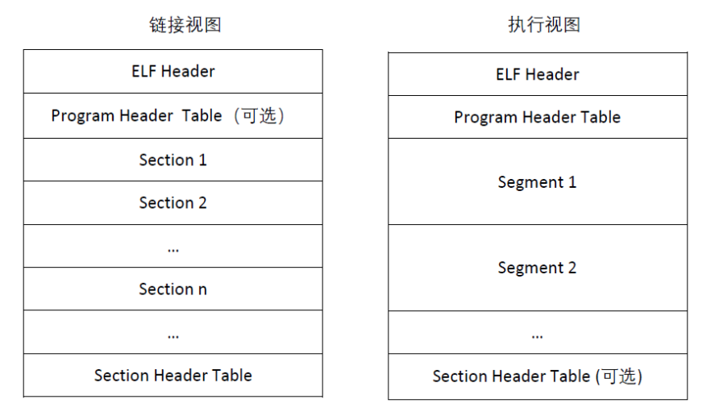
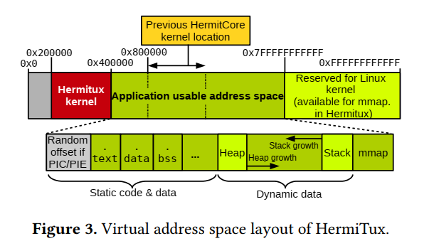
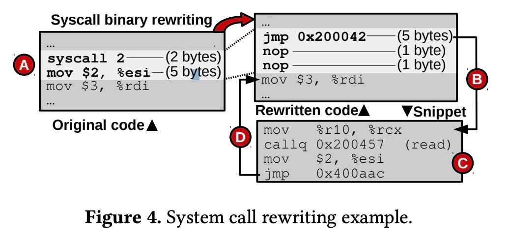

<!-- TOC -->

- [unikernel的二进制兼容性](#unikernel%E7%9A%84%E4%BA%8C%E8%BF%9B%E5%88%B6%E5%85%BC%E5%AE%B9%E6%80%A7)
    - [项目背景](#%E9%A1%B9%E7%9B%AE%E8%83%8C%E6%99%AF)
        - [unikernel 的应用前景](#unikernel-%E7%9A%84%E5%BA%94%E7%94%A8%E5%89%8D%E6%99%AF)
        - [unikernel的问题](#unikernel%E7%9A%84%E9%97%AE%E9%A2%98)
        - [我们要解决的问题](#%E6%88%91%E4%BB%AC%E8%A6%81%E8%A7%A3%E5%86%B3%E7%9A%84%E9%97%AE%E9%A2%98)
    - [理论依据](#%E7%90%86%E8%AE%BA%E4%BE%9D%E6%8D%AE)
        - [ABI](#abi)
        - [ELF（文件格式）](#elf%E6%96%87%E4%BB%B6%E6%A0%BC%E5%BC%8F)
            - [链接视图](#%E9%93%BE%E6%8E%A5%E8%A7%86%E5%9B%BE)
            - [执行视图](#%E6%89%A7%E8%A1%8C%E8%A7%86%E5%9B%BE)
            - [文件头](#%E6%96%87%E4%BB%B6%E5%A4%B4)
    - [技术依据](#%E6%8A%80%E6%9C%AF%E4%BE%9D%E6%8D%AE)
        - [Unikernel的原理](#unikernel%E7%9A%84%E5%8E%9F%E7%90%86)
        - [Hermitux实现二进制支持的细节](#hermitux%E5%AE%9E%E7%8E%B0%E4%BA%8C%E8%BF%9B%E5%88%B6%E6%94%AF%E6%8C%81%E7%9A%84%E7%BB%86%E8%8A%82)
            - [概述](#%E6%A6%82%E8%BF%B0)
                - [加载规则](#%E5%8A%A0%E8%BD%BD%E8%A7%84%E5%88%99)
                - [运行时规则](#%E8%BF%90%E8%A1%8C%E6%97%B6%E8%A7%84%E5%88%99)
                - [其他](#%E5%85%B6%E4%BB%96)
        - [Linux Binary Loader（加载时规则）](#linux-binary-loader%E5%8A%A0%E8%BD%BD%E6%97%B6%E8%A7%84%E5%88%99)
            - [虚拟地址的加载](#%E8%99%9A%E6%8B%9F%E5%9C%B0%E5%9D%80%E7%9A%84%E5%8A%A0%E8%BD%BD)
        - [运行时的处理方式](#%E8%BF%90%E8%A1%8C%E6%97%B6%E7%9A%84%E5%A4%84%E7%90%86%E6%96%B9%E5%BC%8F)
            - [静态链接](#%E9%9D%99%E6%80%81%E9%93%BE%E6%8E%A5)
            - [动态链接](#%E5%8A%A8%E6%80%81%E9%93%BE%E6%8E%A5)
    - [参考文献](#%E5%8F%82%E8%80%83%E6%96%87%E7%8C%AE)

<!-- /TOC -->

# unikernel的二进制兼容性

## 项目背景

unikenel是使用必要的库和精简操作系统层静态编译成二进制文件的应用程序，可以作为虚拟客户程序在管理程序之上执行。

与传统的虚拟机相比，Unikernel设备在保证同等隔离度的前提下，内存占用更小，开销更低。从缺点上看，Unikernel剥离了其单体设备的进程抽象，从而牺牲了灵活性、效率和适用性。

### unikernel 的应用前景

Unikernel将一个简约的LibOS和一个目标应用专门制作成一个独立的单用途虚拟机（VM），运行在一个管理程序上，这就是所谓的（虚拟）设备。与传统的虚拟机相比，Unikernel设备在保证同等隔离度的前提下，内存占用更小，开销更低。从缺点上看，Unikernel剥离了其单体设备的进程抽象，从而牺牲了灵活性、效率和适用性。

### unikernel的问题

虽然unikernel被认为是比容器更安全和更有吸引力的替代方案，但unikernel'仍然难以在工业界获得巨大的吸引力，其采用率增长的相当缓慢。

其中一个主要的原因是，将传统/现有的应用移植到当前的unikernel模型中是很困难的，有时甚至是不可能的。

在使用编译后的专有代码等情况下，由于无法获得应用程序的源码，用户无法使用任何现有的unikernel模型来移植和运行它。这样的二进制文件一般都是经过剥离和混淆的，因此用unikernel层进行拆解和重新链接是不合适的。即使有源码，考虑到支持传统编程语言(C/C++)的unikernel模型，移植一个中/大型或复杂的代码库仍然是困难的。这是由于诸如不兼容/缺失的库/功能、复杂的构建基础架构、缺乏开发者工具（调试器/剖析器）以及不支持的语言等因素造成的。移植的复杂性进一步增加，因为这个过程需要应用程序和所考虑的unikernel模型的专业知识，都会造成应用程序员的负担，所以我们认为这种大量的移植工作是阻碍广泛采用unikernels的最大障碍之一。

并且，unikernel还缺乏一些开发工具，如调试器（debugger）和分析工具（profiler）。

### 我们要解决的问题

如何实现unikernel二进制兼容？

如何在实现二进制兼容的同时还能保持unikernel的一些优点？

如果我们解决了这些问题，加上unikernel相比于容器更安全可靠的优点，我们相信unikernel的应用场景会大大扩展，用户体验会更好，unikernel的发展也会得到提升，甚至有可能使unikernel比容器更受欢迎。

## 理论依据

### ABI

应用程序二进制接口（ABI-Application Binary Interface）定义了一组在PowerPC系统软件上编译应用程序所需要遵循的一套规则。主要包括基本数据类型，通用寄存器的使用，参数的传递规则，以及堆栈的使用等等。

ABI涵盖了以下细节：

- 处理器指令集（包括寄存器的使用，堆栈的使用，访存方式）
- 处理器可以直接访问的基本数据类型的大小、布局和排列方式
- 调用约定，它控制函数的参数如何传递，以及如何获取返回值，比如：
    - 是所有参数都在堆栈中传递，还是部分参数在寄存器中传递
    - 哪些寄存器用于传递哪些函数参数
    - 以及堆栈上传递的第一个函数参数是先推到堆栈还是最后推到堆栈
- 应用程序应该如何对操作系统进行系统调用
- 目标文件、程序库的二进制格式等等

### ELF（文件格式）

ELF 全称 “Executable and Linkable Format”，即可执行可链接文件格式，是一种用于二进制文件、可执行文件、目标代码、共享库和核心转储格式文件。

ELF文件由4部分组成，分别是ELF头（ELF header）、程序头表（Program header table）、节（Section）和节头表（Section header table）。



#### 链接视图

静态链接器（即编译后参与生成最终ELF过程的链接器，如ld ）会以链接视图解析ELF。编译时生成的 .o（目标文件）以及链接后的 .so （共享库）均可通过链接视图解析，链接视图可以没有段表（如目标文件不会有段表）。

#### 执行视图

动态链接器（即加载器，如x86架构 linux下的 /lib/ld-linux.so.2或者安卓系统下的 /system/linker均为动态链接器）会以执行视图解析ELF并动态链接，执行视图可以没有节表。

#### 文件头
ELF的结构声明位于系统头文件 elf.h 中，ELF格式分为32位与64位两种，除了重定位类型稍有区别，其它大致相同，为了简化描述，后续说明将省略32/64字样。

ELF Header的声明如下 :

```
#define EI_NIDENT (16)
typedef struct
{
    unsigned char   e_ident[EI_NIDENT]; /* Magic number and other info */
    Elf_Half        e_type;         /* Object file type */
    Elf_Half        e_machine;      /* Architecture */
    Elf_Word            e_version;      /* Object file version */
    Elf_Addr        e_entry;        /* Entry point virtual address */
    Elf_Off     e_phoff;        /* Program header table file offset */
    Elf_Off     e_shoff;        /* Section header table file offset */
    Elf_Word            e_flags;        /* Processor-specific flags */
    Elf_Half        e_ehsize;       /* ELF header size in bytes */
    Elf_Half        e_phentsize;        /* Program header table entry size */
    Elf_Half        e_phnum;        /* Program header table entry count */
    Elf_Half        e_shentsize;        /* Section header table entry size */
    Elf_Half        e_shnum;        /* Section header table entry count */
    Elf_Half        e_shstrndx;     /* Section header string table index */
} Elf_Ehdr;
```

## 技术依据

### Unikernel的原理

unikernel是云时代的经典系统技术句柄，它将应用程序与操作系统组件库（包括内存管理、调度程序、网络堆栈和设备驱动程序）链接到一个单一的平面地址空间，创建可以直接在（虚拟）硬件上启动的独立二进制映像。

### Hermitux实现二进制支持的细节

#### 概述

Hermitux 完善了一套组成LinuxABI(Linux二进制接口)的规则，这些规则分为以下几块：

##### 加载规则

- 二进制格式支持
- 程序可以访问哪些64位的地址空间
- 通过二进制加载段来设置地址空间
- 特定的寄存器状态
- 栈布局

##### 运行时规则

触发syscall的指令
寄存器传入参数和保存返回值

##### 其他

读写虚拟文件系统、共享内存区域，来与OS进行连接

### Linux Binary Loader（加载时规则）

#### 虚拟地址的加载

Linux  ABI 规定允许用户空间代码访问的地址空间的范围是0x400000到0x7fffffffff。我们将下面的内核定位在0x200000，因为小型的HermiTux内核可以被放在这2 MB里。原来的HermitCore内核以前位于0x800000，我们通过更改内核链接器脚本和更新内核代码中的硬编码引用来重新定位它。（如下图所示）



可以看到，应用程序现在可以访问接近整个48位地址空间。这为我们提供了获得共享库和PIE程序的熵非常高(高于Linux)的随机映射的独特机会。

首先，Uhyve为用户端初始化和分配内存。

接着加载内核：读取内核可执行文件并在客户内存的偏移量处复制可加载的ELF节。可执行文件的加载也遵循相同的原则。

**注意：**出于安全原因，如果应用程序支持PIC/PIE，那么它将以随机偏移量加载（即上图中的灰色部分：random offset if PIC/PIE）。它的入口点地址和加载的节大小被写入客户内存中的特定位置，由内核在引导时检索。

然后将控制传递给用户端并初始化内核：内核内存子系统为应用程序在地址空间的相应区域准备栈和堆。

**注意：**怎样保证设置的栈和堆不冲突呢？hypervisor会获得关于应用程序可加载ELF节的位置和大小的信息（如.text，.data等等），内核就使用这些信息来避免堆栈冲突。

初始化的内核堆栈位于内核内存区域。在应用程序开始运行后，它与内核共享其堆栈（因为在unikernels中，系统调用是普通的函数调用）。内核动态分配的内存（包括堆和ISR堆栈）位于内核内存区域。

在内核初始化之后，会生成一个任务来执行应用程序代码。在跳转到应用程序入口之前，必须用特定的数据填充应用程序堆栈，以便应用程序能够初始化。（实际上，应用程序的入口通常对应于低级库初始化。）

这个引导代码将访问堆栈，目的是恢复一些有关应用程序命令行参数（argc和argv）、环境变量和ELF辅助向量等的重要信息。（内核以相反的顺序将这些元素推入堆栈：辅助向量、环境变量、argv和argc。）

Linux  vDSO（Virtual Dynamically linked Shared Objects，一种将内核空间例程导出到用户空间应用程序的方法，用于链接和加载的标准机制）共享对象在单内核中是没有意义的，因为应用程序和内核共享一个不受保护的地址空间。取消vDSO，并通过ELF辅助向量向栈上的C库表示。

如果二进制文件是动态编译的，那么HermiTux的内核首先加载并运行动态加载器。内核在argv中添加应用程序的二进制名称，动态加载器继续加载这个二进制文件及其共享库依赖项，并在运行时执行重定位。在内核端，这需要对mmap系统调用的全面支持。

### 运行时的处理方式

#### 静态链接

由于程序在内核中，一个简单的处理思想是将syscall直接替换成到相应函数地址的call指令；但是由于syscall只有2字节，call有5字节，因此不能直接替换。
在这里Hermitux的处理方式如下图：



原汇编指令如A中所示，我们需要将syscall替换成call read，但是call指令的字节数过长；
因此将syscall后面的一条5字节的指令连带重写为B中长度为7字节的代码段（jmp、nop、nop）。
根据B中的指令，程序会跳转到C中一段自行编写的代码片段：

* mov %r10,%rcx，此代码是为了适配system call和function call的区别；
* call指令调用read函数的代码。在Hermixtux中，调用syscall原先准备调用的代码；
* 将A中被jmp连带覆写的代码（第二行的mov）继续执行；
* 将程序控制流转回到原程序里。

一个值得注意的问题是：假如有代码会跳转到被复写的代码段当中（比如图中原代码的第二行），会出现问题；这种情况可能发生在函数f1的末尾、f2的开头处。

#### 动态链接

Hermitux的主体思想是自行重写C Library。在这个C Library中，Hermitux只是简单地将（Musl中的）syscall替换为函数调用，这是为了贴合unikernel的避免额外调用unikernel内核以外的程序带来开销的思想。

基于Coccinells代码替换工具，将C library中的调用用一个wrapper来代替；这个wrapper将syscall序号和其他的参数一起作为自己的参数，并使用了一个函数指针的数组（基于syscall序号进行索引）来在kernel中调用这个syscall的代码，以此来实现运行时对动态链接代码的支持。

## 参考文献

- Pierre Olivier, Daniel Chiba, Stefan Lankes, Changwoo Min, and Binoy Ravindran. 2019. A binary-compatible unikernel. In Proceedings of the 15th ACM SIGPLAN/SIGOPS International Conference on Virtual Execution Environments (VEE 2019). Association for Computing Machinery, New York, NY, USA, 59–73. DOI:https://doi.org/10.1145/3313808.3313817