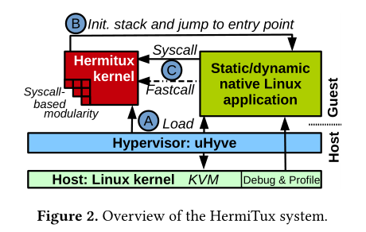

<!-- TOC -->

- [OSH 调研报告](#osh-%E8%B0%83%E7%A0%94%E6%8A%A5%E5%91%8A)
    - [项目简介](#%E9%A1%B9%E7%9B%AE%E7%AE%80%E4%BB%8B)
    - [项目背景](#%E9%A1%B9%E7%9B%AE%E8%83%8C%E6%99%AF)
        - [UniKernel 介绍](#unikernel-%E4%BB%8B%E7%BB%8D)
        - [Unikernel 优势](#unikernel-%E4%BC%98%E5%8A%BF)
        - [Unikernel 问题](#unikernel-%E9%97%AE%E9%A2%98)
    - [立项依据](#%E7%AB%8B%E9%A1%B9%E4%BE%9D%E6%8D%AE)
    - [前瞻性 & 重要性分析](#%E5%89%8D%E7%9E%BB%E6%80%A7--%E9%87%8D%E8%A6%81%E6%80%A7%E5%88%86%E6%9E%90)
    - [相关工作](#%E7%9B%B8%E5%85%B3%E5%B7%A5%E4%BD%9C)
        - [Unikernel的二进制兼容性](#unikernel%E7%9A%84%E4%BA%8C%E8%BF%9B%E5%88%B6%E5%85%BC%E5%AE%B9%E6%80%A7)
            - [Linux ABI](#linux-abi)
            - [系统概览](#%E7%B3%BB%E7%BB%9F%E6%A6%82%E8%A7%88)
            - [加载时二进制可兼容性](#%E5%8A%A0%E8%BD%BD%E6%97%B6%E4%BA%8C%E8%BF%9B%E5%88%B6%E5%8F%AF%E5%85%BC%E5%AE%B9%E6%80%A7)
            - [运行时二进制可兼容性](#%E8%BF%90%E8%A1%8C%E6%97%B6%E4%BA%8C%E8%BF%9B%E5%88%B6%E5%8F%AF%E5%85%BC%E5%AE%B9%E6%80%A7)
            - [延续Unikernel的优势&隔离](#%E5%BB%B6%E7%BB%ADunikernel%E7%9A%84%E4%BC%98%E5%8A%BF%E9%9A%94%E7%A6%BB)
                - [系统调用](#%E7%B3%BB%E7%BB%9F%E8%B0%83%E7%94%A8)
                - [模块化](#%E6%A8%A1%E5%9D%97%E5%8C%96)
    - [参考文献](#%E5%8F%82%E8%80%83%E6%96%87%E7%8C%AE)

<!-- /TOC -->

# OSH 调研报告

## 项目简介

本项目旨在已有项目的基础上，继续改进 Unikernel 的二进制兼容性和易用性，做出可以即时打包、分发的 Unikernel。

参考项目：[HermiTux](https://github.com/ssrg-vt/hermitux)

## 项目背景

### UniKernel 介绍

Unikernel 是使用 LibOS 构建的一个专门的、单一地址空间的操作系统。将操作系统的最少必要组件和程序本身打包在一起，直接运行在虚拟层或硬件上，显著提升了隔离性和效率。

目前的较为成熟的 Unikernel 项目：

- MigrateOS，使用 OCaml 进行开发
- HaLVM，使用 Haskell
- IncludeOS，使用 C++
- Clive，使用 Go

### Unikernel 优势

1. 性能好。内核和应用程序没有隔离，运行在同一个地址空间中，消除了用户态和内核态转换以及数据复制的开销。
2. 体积小。通过仅包含必要的运行环境和内核函数，Unikernel 的体积非常小。通过对网络功能的裁剪，HermiTux 内核在硬盘上只占用 57 kb 的空间。
3. 启动快。Unikernel 裁剪了大部分程序不需要用到的内核功能。
4. 安全。Unikernel 提供了与传统虚拟化技术（如 KVM）相等的隔离性，同时由于功能的单一化，减小了攻击面。

### Unikernel 问题

1. 容易造成内存的浪费。为 Unikernel 分配的内存往往不会被完全利用，但无法释放回 HostKernel。
2. 没有进程。Unikernel 为单应用内核。
3. 无法调试。Unikernel 缺少调试的必要组件如 gdb。
4. 需要重新共同编译程序，使 Unikernel 无法与未知源码的二进制程序打包。

## 立项依据

- Unikernel 以其轻量、高效和安全性，在云计算等领域颇具潜力

- 目前的 Unikernel 实现均要求对应用的重构，在实际应用中无法获取程序源码、程序依赖未被支持等问题非常常见
- 将应用打包为 Unikernel 要求大量的专业知识，步骤繁琐

我们希望在保持 Unikernel 现有优势（高效、安全、轻量）的前提下，改善 Unikernel 对二进制程序的支持，从根本上解决上述困难。

## 前瞻性 & 重要性分析

Unikernel 是一个安全、轻量而高效的运行环境。其应用前进十分广泛，被誉为“Linux 领域的下一代支配者”[?]。

但目前 Unikernel 推广十分缓慢，部分原因如下：

- 如果无法获得程序源代码，重新编译和链接将无从进行，也就不可能打包到 Unikernel。
- 对二进制文件的逆向往往会因为编译过程中的剥离和混淆难以进行。
- 移植上古代码时，如果 Unikernel 不支持对应语言，就必须重写项目。
- 让 Unikernel 支持某种语言十分困难，Unikernel 通常只支持一小部分的内核特性和软件库。如果语言用到了不支持的内容，就需要重写应用，很多情况下这意味着应用完全不可能被移植。
- 编写 Unikernel 模型，会给程序员添加负担。
- Unikernel 使用复杂的构建工具，将一些传统应用的大型构建基础架构（大量的 Makefile、autotools/cmake 环境）加入 Unikernel 工具链是十分麻烦。

如果可以直接将二进制程序移植到 Unikernel，上述问题都会迎刃而解。而目前致力于提供二进制兼容性的 Unikernel 项目 HermiTux 仍有较大改进空间，因此我们将改善 HermiTux 二进制兼容性作为立项目标。

## 相关工作

### Unikernel的二进制兼容性

#### Linux ABI

为了提供二进制兼容性，HermiTux 的内核需要遵守构成 Linux  ABI 的一组规则。这些规则可以大致分为加载时规则和运行时规则。

加载时间规则包括支持的二进制格式(ELF)，应用程序可以访问64位地址空间的哪一部分，通过从二进制文件加载段来设置地址空间的方法，以及特定的寄存器状态和堆栈布局(命令行参数、环境变量、ELF辅助向量)预期在应用程序入口点。

运行时规则包括用于触发系统调用的指令，以及包含其参数和返回值的寄存器。最后，Linux 应用程序还希望通过读写各种虚拟文件系统(/proc， /sys等)来与操作系统通信，以及通过与内核共享的内存区域: vDSO/vsyscall。

#### 系统概览

HermiTux 的设计目标是在加载和运行时模拟 Linux  ABI，同时提供 unikernel 原则。通过使用自定义ELF加载器来确保加载时间约定。而运行时规则的遵循是通过在 HermiTux 的内核中实现一个类似 linux 的系统调用处理程序。

HermiTux 还维护了一些单内核的优点(快速的系统调用和模块化)。

上图展示了系统的概览视图。

1. 在启动时，hypervisor 为客户机分配内存作为其物理内存。
2. 接下来，hypervisor 在该区域的特定位置加载 HermiTux 内核（图中的 A），然后在ELF元数据中指出的位置从Linux二进制文件加载可加载的 ELF 段。
3. 在加载过程之后，控制被传递给客户端并初始化内核。设置页表是为了构建一个同时包含内核和应用程序的地址空间。遵循单核原则，内核和应用程序都在保护环0中执行。
4. 在初始化之后，内核按照Linux的加载约定为应用程序分配和初始化一个栈，然后跳转到可执行入口点B，该入口点B的地址是在加载时从ELF元数据中读取的。在应用程序执行期间，系统调用将根据Linux惯例，使用syscall x86-64指令执行。
5. 内核通过实现一个系统调用处理程序来捕获这样的调用，该处理程序识别被调用的系统调用，从CPU寄存器中确定参数，并调用所考虑的系统调用 C 的 HermiTux 实现。

#### 加载时二进制可兼容性

Linux将48位虚拟地址空间的上半部分专用于内核，而由于 HermiTux 内核对虚拟/物理内存的需求非常小，因此可以将其定位在为应用程序保留的区域下面。这使应用程序可以访问虚拟地址空间的主要部分。

HermiTux 支持如下的动态编译二进制文件：当加载器检测到这样的二进制文件时，它加载并将控制传递给动态加载器，轮到后者来加载应用程序和库依赖项，并负责符号的重定位。

与 KylinX 相反，HermiTux 不在多个 unikernel 之间共享虚拟地址空间中的动态库。这主要是出于安全原因，因为虚拟机之间的共享内存可能使它们容易受到侧通道的攻击（例如 Flush + Reload 或 Prime + Probe）。

HermiTux的目标是同时支持静态和动态的链接。

#### 运行时二进制可兼容性

HermiTux支持Linux规定的系统调用，而现有的unikernels内核不支持。HermiTux实现了在执行syscall指令时调用的系统调用处理程序。在系统调用级别上与应用程序接口是HermiTux提供的二进制兼容性的核心。

但是，这并不代表Linux系统调用接口的完全重新实现：虽然它相当大（超过350个系统调用），但应用程序通常只使用该接口的一小部分。只要实现200个系统调用，就可以支持90%的标准发行版二进制文件。

HermiTux 的原型实现了83个系统调用。

#### 延续Unikernel的优势&隔离

##### 系统调用

HermiTux依靠两种技术提供快速的系统调用（Fastcall）。

对于静态二进制程序，可使用二进制工具将应用程序中发现的syscall指令用常规函数调用重写到相应的单核实现中。

对于动态链接的程序，有以下特点：

1. 大部分的系统调用都是由C库完成的；

2. C库接口定义得非常好，所以可以在运行时链接一个程序，而这个程序的共享C库并不是程序编译时的库。

然后，对动态链接的程序使用HermiTux设计的一个单核感知的C库，它是直接对内核进行函数调用，代替系统调用。这种技术称为库替换。

##### 模块化

由于要实现二进制兼容性，HermiTux 中的系统调用代码库相对较大。

设计内核时，每个系统调用的实现都可以在内核构建时编译进去或编译出来。

除了减少内存占用外，这样做还有比传统的系统调用过滤（如seccomp）更强的安全优势：不仅无法调用相关的系统调用，而且它们的实现完全不在内核中，这意味着它们不能被用于代码重用攻击。

HermiTux设计了一个二进制分析工具，能够扫描一个可执行文件，并检测该程序可以进行的各种系统调用。

HermiTux的内核中实现了一个基本的RAM文件系统——MiniFS，从而在这方面消除了对主机的依赖。

## 参考文献

- [1] 高策. 2017. Unikernel：从不入门到入门. https://gaocegege.com/Blog/%E5%AE%89%E5%88%A9/unikernel-book
- [2] Bryan Cantrill. 2016. Unikernels are unfit for production. https://www.joyent.com/blog/unikernels-are-unfit-for-production
- [3] Hacker News 2017. 2016. Unikernels are entirely undebuggable. https://news.ycombinator.com/item?id=10954132
- [4] Pierre Olivier, Daniel Chiba, Stefan Lankes, Changwoo Min, and Binoy Ravindran. 2019. A binary-compatible unikernel. In Proceedings of the 15th ACM SIGPLAN/SIGOPS International Conference on Virtual Execution Environments (VEE 2019). Association for Computing Machinery, New York, NY, USA, 59–73. DOI:https://doi.org/10.1145/3313808.3313817
- [5] Filipe Manco, Costin Lupu, Florian Schmidt, Jose Mendes, Simon Kuenzer, Sumit Sati, Kenichi Yasukata, Costin Raiciu, and Felipe Huici. 2017. My VM is Lighter (and Safer) Than Your Container. In Proceedings of the 26th Symposium on Operating Systems Principles (SOSP ’17). ACM, New York, NY, USA, 218–233. DOI:http://dx.doi.org/10.1145/3132747.3132763
- [6] OSv Contributors 2014. Porting native applications to OSv: problems you may run into. (2014). https://github.com/cloudius-systems/osv/wiki/Porting-native-applications-to-OSv.
- [7] Sören Bleikertz. 2011. How to run Redis natively on Xen. https://openfoo.org/blog/redis-native-xen.html.
- [8] Stefan Lankes, Simon Pickartz, and Jens Breitbart. 2016. HermitCore: a unikernel for extreme scale computing. In Proceedings of the 6th International Workshop on Runtime and Operating Systems for  upercomputers (ROSS 2016). ACM
- [9] Unikernel Blog. 2017. Unikernels are Secure. http://unikernel.org/blog/2017/unikernels-are-secure. 
- [10] Florian Schmidt. 2017. uniprof: A Unikernel Stack Profiler. In Proceedings of the ACM Special Interest Group on Data Communication Conference (Posters and Demos) (SIGCOMM’17). ACM, 31–33.